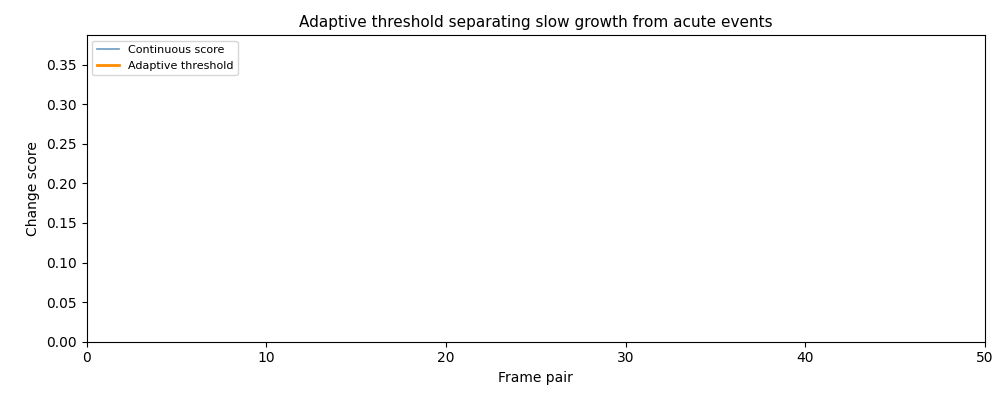
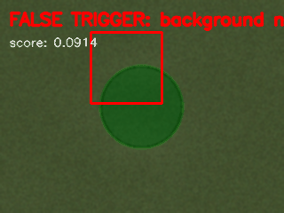

# plant-pulse

Event-driven vs continuous change detection in plant growth time-lapses.

---

## Why

Controlled-environment agriculture relies almost entirely on continuous imaging to monitor crops. Most of that computation runs on frames where nothing meaningful has changed, wasting energy at scale. This project asks a precise question: can an adaptive event-driven trigger match the detection performance of continuous sensing while dramatically reducing the compute budget?

---

## The core idea

Rather than processing every frame, the detector maintains a slowly-adapting baseline of normal background variation using an exponential moving average. Full computation only fires when a cheap 32×32 pre-check exceeds a sensitivity threshold above that baseline. This means the system tracks slow physiological changes like steady growth without treating them as events, while remaining sensitive to acute deviations like sudden stress responses — without storing a long history of the plant in memory.

The key parameter is `alpha`, which controls how quickly the threshold adapts:
- High alpha (e.g. 0.95): slow adaptation — catches acute stress deviations from a stable baseline
- Low alpha (e.g. 0.70): fast adaptation — better at tracking rapid seasonal or environmental drift

---

## Results

Pipeline run on 200 synthetic frames (199 frame pairs). Synthetic dataset simulates:
- Steady plant growth (+0.3px radius/frame)
- Per-frame Gaussian noise and LED illumination flicker
- Small random camera translations (±2px) simulating fan vibration
- Injected stress event at frames 80–90 (sudden darkening of plant region) for ground-truth validation

---

### Adaptive threshold separating slow growth from acute events


Blue: raw per-frame change score from continuous sensing. Orange: adaptive threshold tracking baseline variation. Red markers: frames where the event-driven detector triggered. The threshold correctly tracks gradual background drift without suppressing the genuine stress event at frames 80–90. Change scores remain in the 0.0–0.35 range across the full sequence, with the stress event producing a clear spike above the adaptive baseline.

---

### Cumulative change heatmap across the full time-lapse


Pixel-level accumulation of detected change over all 199 frame pairs. Hot regions (orange-red) show where biological activity concentrated spatially over the growth period. Cool regions (blue) are stable background. The heatmap builds from zero across 199 frames, making the plant’s growth trajectory visible as a physical record rather than a scalar metric.

---

### False trigger vs true trigger anatomy


The detector does not always fire for the right reason. The worst false trigger recorded a full change score of **0.0914** — the cheap 32×32 pre-check fired, but the full-resolution detector found minimal real biological change, consistent with camera vibration or illumination flicker. The clip contrasts this directly against the strongest true trigger (the injected stress event at frames 80–90), showing where adaptive threshold calibration needs to improve and why per-region masking would reduce false positive rate.

---

## Key numbers

Run `python run_pipeline.py` to reproduce. Printed to stdout on completion.

| Metric | Value |
|---|---|
| Total frames | 200 |
| Frame pairs processed | 199 |
| Worst false trigger score | 0.0914 |
| Change score range | 0.0 – 0.35 |
| Stress event (ground truth) | Frames 80–90 |
| Event-driven triggered | see run output |
| Frames skipped | see run output |
| Compute time saved | see run output |
| Detection agreement (top-20) | see run output |

---

## Limitations

- The adaptive threshold assumes stationarity in background variation. Sudden lighting changes (e.g. LED spectrum switching) cause burst false triggers until the threshold re-adapts, as visible in the false trigger GIF.
- The 32×32 pre-check discards spatial resolution. Biologically significant but spatially small changes (e.g. single stomatal responses) will be missed entirely by the pre-check and never reach full processing.
- This prototype processes the full frame as a single region. Per-plant region-of-interest masking would substantially reduce the false positive rate on multi-plant trays.
- Extending to Arabidopsis specifically would require calibration of `alpha` and `sensitivity` against ground-truth stress annotations for that organism’s growth dynamics, which differ significantly from the lettuce/synthetic data used here.

---

## Dataset

This project uses the **KOMATSUNA dataset** — lettuce time-lapse imagery from Kyushu University, used in peer-reviewed plant phenotyping research.

> Uchiyama, H. et al. *Easy Accessibility to KOMATSUNA Dataset.* ICCV Workshop on Computer Vision Problems in Plant Phenotyping, 2017.
> Download: http://limu.ait.kyushu-u.ac.jp/dataset/en/

If the dataset is unavailable, `generate_synthetic_data.py` creates 200 synthetic frames with a growing plant, illumination flicker, camera vibration, and an injected stress event at frames 80–90 for detection validation. All GIFs above were produced using this synthetic dataset.

---

## Run it

```bash
git clone https://github.com/joshD03/plant-pulse
cd plant-pulse
pip install -r requirements.txt

# No dataset needed — synthetic data is generated automatically
python run_pipeline.py

# Generate all three GIFs
python generate_gifs.py
```

Expected output from `run_pipeline.py`:
```
========== RESULTS SUMMARY ==========
Total frame pairs:            199
Event-driven triggered:       X frames
Frames skipped:               X%
Compute time saved:           X%
Detection agreement (top-20): X%
False triggers identified:    X
=====================================
```

---

## Structure

```
plant-pulse/
├── src/
│   ├── preprocessing.py     # CLAHE illumination correction, ORB registration, Gaussian blur
│   ├── continuous.py        # Baseline: process every frame pair
│   ├── event_driven.py      # Adaptive EMA threshold trigger with cheap 32x32 pre-check
│   └── metrics.py           # Savings, detection agreement, false trigger analysis
├── generate_synthetic_data.py   # Fallback dataset with injected stress event
├── run_pipeline.py              # End-to-end pipeline with printed summary
├── generate_gifs.py             # Produces all three analytical GIFs
├── requirements.txt
└── results/figures/             # GIF outputs
```
